# Cel projektu

Celem niniejszego projektu jest analiza danych o połowach śledzi oceanicznych wyławianych w Europie z ostatnich 60 lat. Analiza danych ma wskazać główne przyczyny zjawiska stopniowego karłowacenia tych śledzi na przestrzeni lat.

# Podsumowanie i wnioski

## Wnioski
Analiza danych zawarta w projekcie wykazała, że za karłowacenie śledzi na przestrzeni lat, odpowiadają przede wszystkim intesywne połowy oraz wzrost temperatury wody. Można pokusić się o wskazanie wzrostu liczby ludności (a przy tym popytu na ryby) oraz globalnego ocieplenia jako główne czynniki powodujące obserwowane zjawisko

## Obserwacje

Analizowany zbiór danych posiadał pewien istotny mankament - rekord nie posiadały szczegółowej informacji na temat daty wykonania pomiaru. Jest to o tyle problematyczne, iż nie można w łatwy sposób przyporządkować dany rekord do roku. Wprowadza to szereg utrudnień, m. in z wyznaczeniem wykresu rozmiaru od roku, czy też w ogólności grupowane rekordów według daty.

# Wykorzystanie narzędzia

W ramach analizy danych w niniejszym projekcie zostały wykorzystane następujące pakiety:

|         |
|:--------|
|mlbench  |
|dplyr    |
|caret    |
|lattice  |
|ggplot2  |
|knitr    |
|bazar    |
|corrplot |
|tidyr    |

# Informacje na temat zbioru danych

Niniejsza sekcja poświęcona jest podstawowym informacjom odnosnie analizowanego zbioru danych.

## Podstawowe informacje
Zbiór danych przed dalszą anlizą został oczyszczony z brakujących danych - rekordy zawierające puste kolumny zostały usunięte ze zbioru. Poniżej znajdują się informacje odnośnie oczyszczonego zbioru danych.


```
## [1] "Liczba wierszy:  42488"
```

```
## [1] "Liczba kolumn:  16"
```

### Nagłówki kolumn i kilka przykładowych wierszy zaprezentowane poniżej.


       X   length  cfin1     cfin2     chel1     chel2      lcop1     lcop2        fbar     recr        cumf     totaln  sst                   sal   xmonth   nao
---  ---  -------  --------  --------  --------  ---------  --------  ---------  ------  -------  ----------  ---------  --------------  ---------  -------  ----
2      1     22.5  0.02778   0.27785   2.46875   21.43548   2.54787   26.35881    0.356   482831   0.3059879   267380.8  14.3069330186    35.51234        7   2.8
3      2     25.0  0.02778   0.27785   2.46875   21.43548   2.54787   26.35881    0.356   482831   0.3059879   267380.8  14.3069330186    35.51234        7   2.8
4      3     25.5  0.02778   0.27785   2.46875   21.43548   2.54787   26.35881    0.356   482831   0.3059879   267380.8  14.3069330186    35.51234        7   2.8
5      4     24.0  0.02778   0.27785   2.46875   21.43548   2.54787   26.35881    0.356   482831   0.3059879   267380.8  14.3069330186    35.51234        7   2.8
7      6     24.0  0.02778   0.27785   2.46875   21.43548   2.54787   26.35881    0.356   482831   0.3059879   267380.8  14.3069330186    35.51234        7   2.8
8      7     23.5  0.02778   0.27785   2.46875   21.43548   2.54787   26.35881    0.356   482831   0.3059879   267380.8  14.3069330186    35.51234        7   2.8

### Podstawowe metryki zbioru danych.


           X             length         cfin1           cfin2            chel1            chel2            lcop1            lcop2            fbar             recr              cumf             totaln                   sst             sal            xmonth            nao         
---  --------------  -------------  --------------  --------------  ---------------  ---------------  ---------------  ---------------  ---------------  ----------------  ----------------  ----------------  --------------------  --------------  ---------------  -----------------
     Min.   :    1   Min.   :19.0   0      :11886   0.70118: 3674   11.5    : 4024   5.67765 : 3674   23      : 4024   9.17171 : 3674   Min.   :0.0680   Min.   : 140515   Min.   :0.06833   Min.   : 144137   13.6315997001: 3674   Min.   :35.40   Min.   : 1.000   Min.   :-4.89000 
     1st Qu.:13233   1st Qu.:24.0   0.02778: 1845   0      : 3166   2.46875 : 1845   21.67333: 3089   2.54787 : 1845   24.85867: 3089   1st Qu.:0.2270   1st Qu.: 360061   1st Qu.:0.14809   1st Qu.: 306068   14.0693330238: 3089   1st Qu.:35.51   1st Qu.: 5.000   1st Qu.:-1.90000 
     Median :26308   Median :25.5   1.02508: 1728   0.296  : 3089   12.15192: 1747   39.56809: 1739   12.49588: 1747   41.65566: 1739   Median :0.3320   Median : 421391   Median :0.23191   Median : 539558   14.4415996823: 1739   Median :35.51   Median : 8.000   Median : 0.20000 
     Mean   :26316   Mean   :25.3   1.21333: 1649   0.11736: 1739   6.42127 : 1728   26.81218: 1649   10.92857: 1728   45.70773: 1649   Mean   :0.3306   Mean   : 519877   Mean   :0.22987   Mean   : 515082   13.5598663683: 1649   Mean   :35.51   Mean   : 7.252   Mean   :-0.09642 
     3rd Qu.:39447   3rd Qu.:26.5   0.33333: 1621   4.55825: 1649   19.15475: 1649   15.03   : 1625   21.23147: 1649   17.68   : 1625   3rd Qu.:0.4650   3rd Qu.: 724151   3rd Qu.:0.29803   3rd Qu.: 730351   13.694933032 : 1625   3rd Qu.:35.52   3rd Qu.: 9.000   3rd Qu.: 1.63000 
     Max.   :52580   Max.   :32.5   0.11111: 1572   0.85684: 1392   9.66667 : 1621   9.43208 : 1392   27.33333: 1621   10.72889: 1392   Max.   :0.8490   Max.   :1565890   Max.   :0.39801   Max.   :1015595   13.861999695 : 1392   Max.   :35.61   Max.   :12.000   Max.   : 5.08000 
     NA              NA             (Other):22187   (Other):27779   (Other) :29874   (Other) :29320   (Other) :29874   (Other) :29320   NA               NA                NA                NA                (Other)      :29320   NA              NA               NA               

## Rozkłady zmiennych
Poniżej zaprezentowane są histogramy wszystkich obecnych zmiennych w danych (z wyłączeniem kolumny pełniącej funkcję porządkową).

### Długość złowionego śledzia [cm] - length
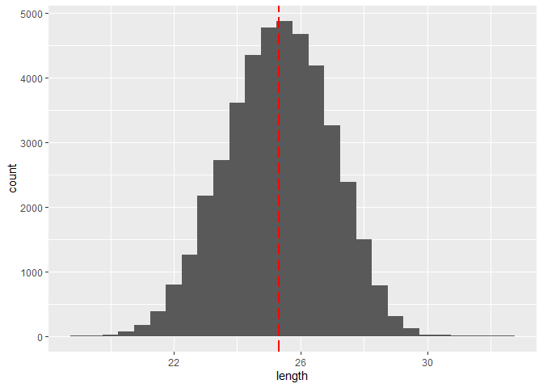<!-- -->

### Dostępność planktonu [zagęszczenie Calanus finmarchicus gat. 1] - cfin1
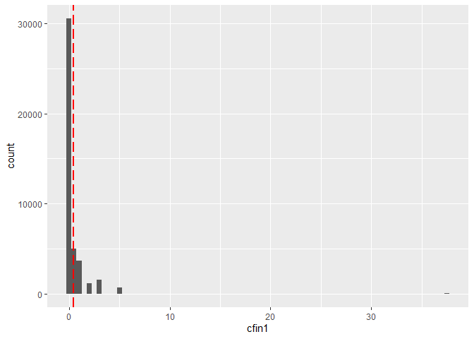<!-- -->

### Dostępność planktonu [zagęszczenie Calanus finmarchicus gat. 2] - cfin2
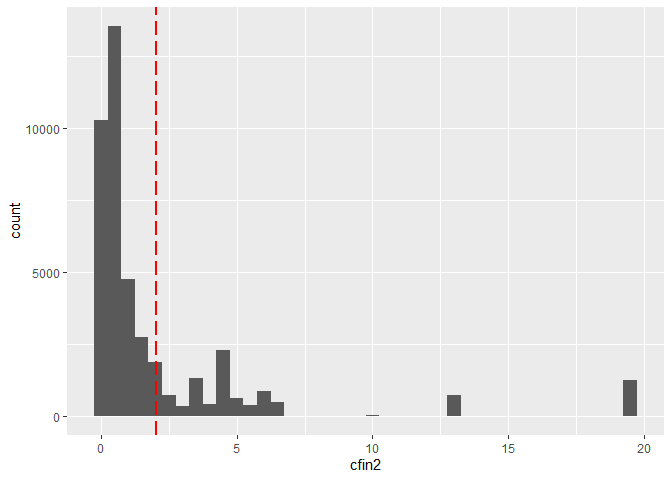<!-- -->

### Dostępność planktonu [zagęszczenie Calanus helgolandicus gat. 1] - chel1
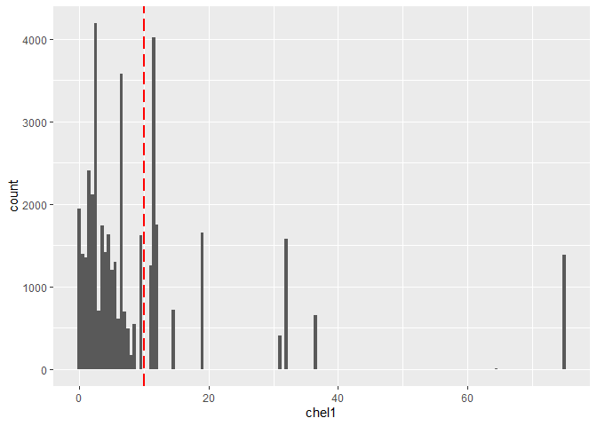<!-- -->

### Dostępność planktonu [zagęszczenie Calanus helgolandicus gat. 2] - chel2
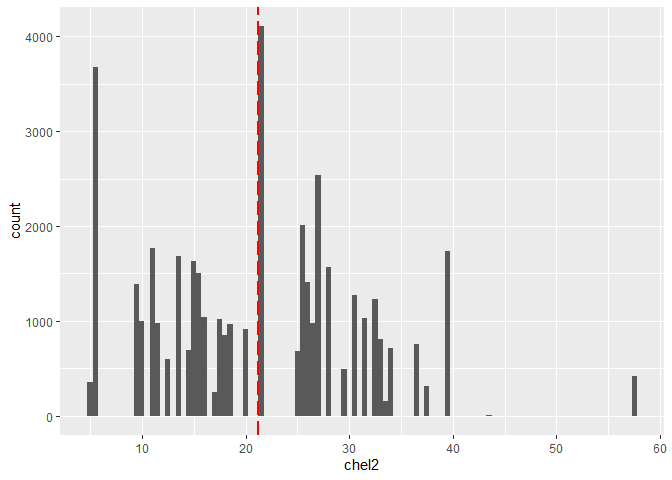<!-- -->

### Dostępność planktonu [zagęszczenie widłonogów gat. 1] - lcop1
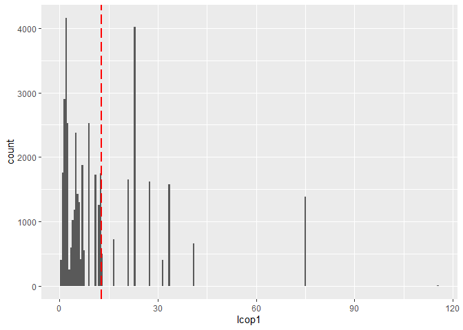<!-- -->

### Dostępność planktonu [zagęszczenie widłonogów gat. 2] - lcop2
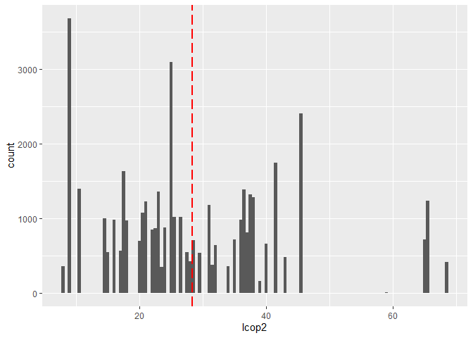<!-- -->

### Natężenie połowów w regionie [ułamek pozostawionego narybku] - fbar
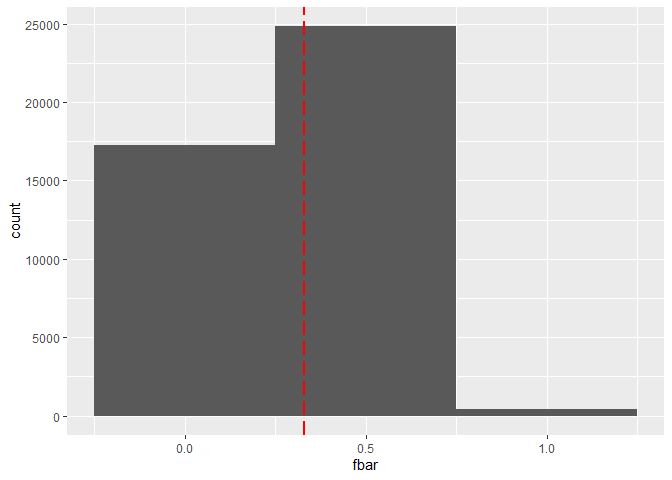<!-- -->

### Roczny narybek [liczba śledzi] - recr
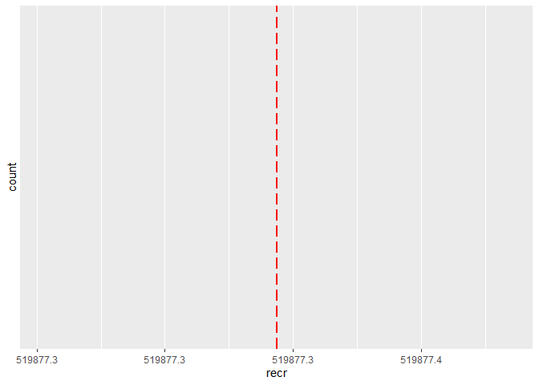<!-- -->

### Łączne roczne natężenie połowów w regionie [ułamek pozostawionego narybku] - cumf
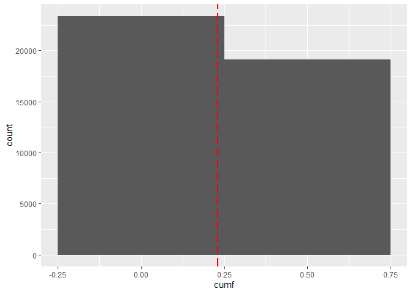<!-- -->

### Łączna liczba ryb złowionych w ramach połowu [liczba śledzi] - totaln
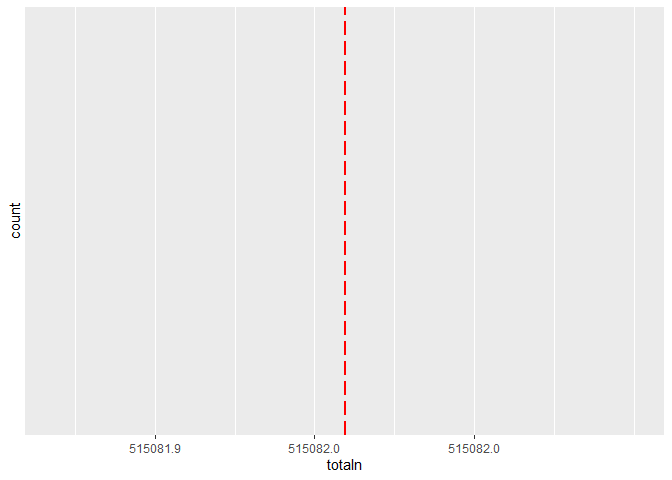<!-- -->

### Temperatura przy powierzchni wody [°C] - sst
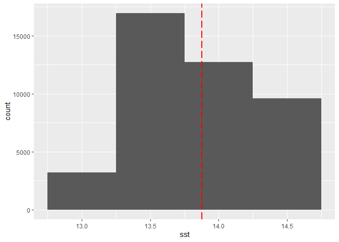<!-- -->

### Poziom zasolenia wody [Knudsen ppt] - sal
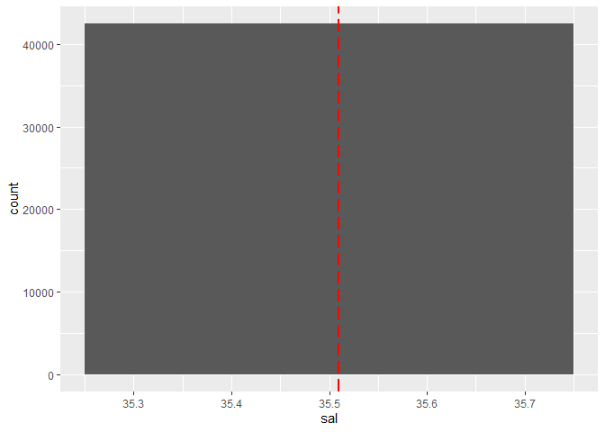<!-- -->

### Miesiąc połowu [numer miesiąca] - xmonth
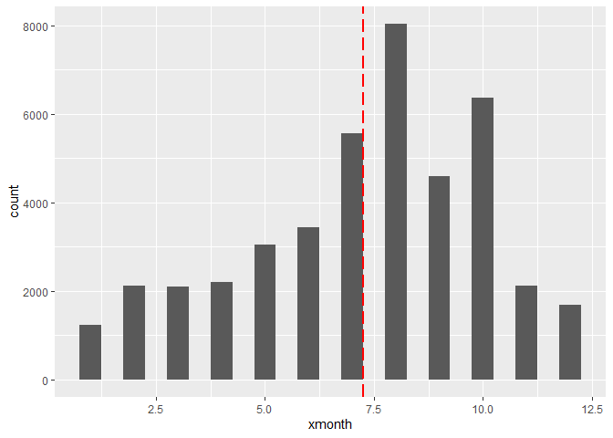<!-- -->

### Oscylacja północnoatlantycka [mb] - nao
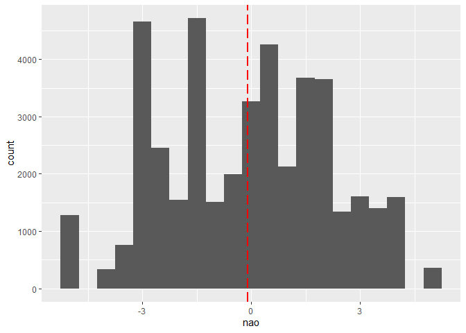<!-- -->

# Analiza danych

## Postęp zjawiska karłowacenia śledzi
Aby potwierdzić zjawisko karłowacenia śledzi, należy sporządzić wykres zmiany długości złowionych osobników w czasie. Na wykresie dosyć wyraźnie jest zaznaczony stopniowy spadek rozmiaru śledzia. Z uwagi na chronologiczne uporządkowanie rekordów oraz brak znaczników czasowych, jako oś czasu została wykorzystana zmienna porządkowa - "X".

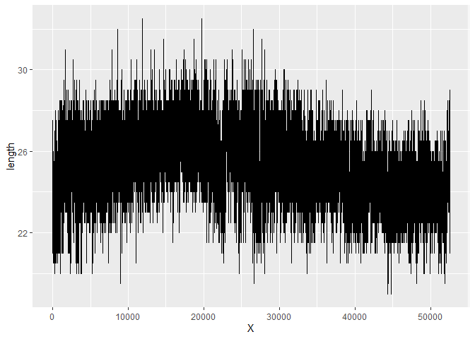<!-- -->

## Korelacja zmiennych

Wykres korelacji zmiennych znajduje się poniżej. W celu zwiększenia czytelności, zostały ukryte powtarzające się w macierzy wartości.

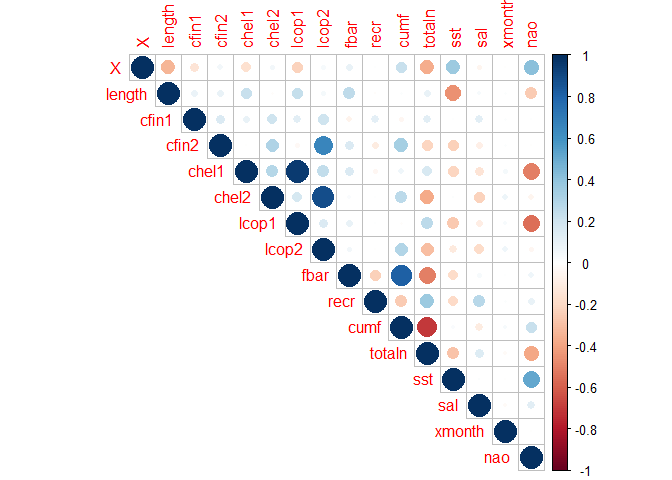<!-- -->

Z powyższego wykresu korelacji można wyciągnąć kilka wniosków.Interesuje nas szczególnie korelacja z zmiennych z długością śledzi. Dodatnią korelację w pewnym stopniu wykazuje: zagęszczenie Calanus helgolandicus gat.1, zagęszczenie widłonogów gat. 1 oraz ułamek pozostawionego narybku. Jeśli chodzi o korelację ujemną, bardzo silnie skorelowana jest temperatura przy powierzchni wody oraz w niewielkim stopniu oscylacja północnoatlantycka. Wymienione powyżej zmienne warto brać pod uwagę przy analizie przyczyny karłowacenia.

# Predykcja


Aby zapewnić zadowalające wyniki analizy, zostały stworzone, wytrenowane i przetestowane trzy modele regresji dostępne w bibliotece caret, opierające się na różnych algorytmach: Linear Regression, Random Forest oraz SVM. Poniżej znajdą się efekty trenowania poszczególnych modeli.

## Linear Regression


```
## Linear Regression 
## 
## 29744 samples
##    15 predictor
## 
## No pre-processing
## Resampling: Cross-Validated (2 fold, repeated 5 times) 
## Summary of sample sizes: 14873, 14871, 14871, 14873, 14873, 14871, ... 
## Resampling results:
## 
##   RMSE     Rsquared   MAE     
##   1.32704  0.3515336  1.049667
## 
## Tuning parameter 'intercept' was held constant at a value of TRUE
```

## Random Forest


## SVM


## Porównanie efektywności modeli

Porównanie wybranych modeli pod kątem metryk R2, RMSE i MAE wskazuje, iż najlepszym z nich jest model Random Forest.


# Analiza wyników modeli

W celu poznania przyczyny karłowacenia śledzi z dostępnych danych, zostałe one oczyszczone oraz przeanalizowane za pomocą modelu regresji. Poniżej prezentuje się rezultat wytrenowania i uruchomienia najlepszego modelu (Random Forest), zawierający najbardziej znaczące cechy w kontekście przewidywania długości śledzi.

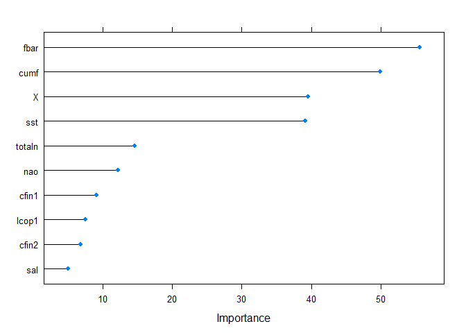<!-- -->

Jak widać najbardziej istotne cechy to: natężenie połowów w regionie, łączne roczne natężenie połowów w regionie oraz temperatura przy powierzchni wody. Zmienną "X" celowo pomijam, ponieważ jes to tylko liczba porządkowa, niezwiązana realnie z danymi.


