-   [Cel projektu](#cel-projektu)
-   [Podsumowanie i wnioski](#podsumowanie-i-wnioski)
    -   [Wnioski](#wnioski)
    -   [Obserwacje](#obserwacje)
-   [Wykorzystanie narzędzia](#wykorzystanie-narzędzia)
-   [Informacje na temat zbioru
    danych](#informacje-na-temat-zbioru-danych)
    -   [Podstawowe informacje](#podstawowe-informacje)
    -   [Rozkłady zmiennych](#rozkłady-zmiennych)
-   [Analiza danych](#analiza-danych)
    -   [Postęp zjawiska karłowacenia
        śledzi](#postęp-zjawiska-karłowacenia-śledzi)
    -   [Korelacja zmiennych](#korelacja-zmiennych)
-   [Predykcja](#predykcja)
    -   [Linear Regression](#linear-regression)
    -   [Random Forest](#random-forest)
    -   [SVM](#svm)
    -   [Porównanie efektywności
        modeli](#porównanie-efektywności-modeli)
-   [Analiza wyników modeli](#analiza-wyników-modeli)

Cel projektu
============

Celem niniejszego projektu jest analiza danych o połowach śledzi
oceanicznych wyławianych w Europie z ostatnich 60 lat. Analiza danych ma
wskazać główne przyczyny zjawiska stopniowego karłowacenia tych śledzi
na przestrzeni lat.

Podsumowanie i wnioski
======================

Wnioski
-------

Analiza danych zawarta w projekcie wykazała, że za karłowacenie śledzi
na przestrzeni lat odpowiadają przede wszystkim wzrost temperatury wody
oraz dostępność niektórych odmian planktonu.

Obserwacje
----------

Analizowany zbiór danych posiadał pewien istotny mankament - rekordy nie
posiadały szczegółowej informacji na temat daty wykonania pomiaru. Jest
to o tyle problematyczne, ponieważ nie można w łatwy sposób
przyporządkować danego rekordu do roku. Wprowadza to szereg utrudnień,
m. in. z wyznaczeniem wykresu rozmiaru śledzia od roku, czy też w
ogólności grupowane rekordów według daty.

Wykorzystanie narzędzia
=======================

W ramach analizy danych w niniejszym projekcie zostały wykorzystane
następujące pakiety:

|          |
|:---------|
| mlbench  |
| dplyr    |
| caret    |
| lattice  |
| ggplot2  |
| knitr    |
| bazar    |
| corrplot |
| tidyr    |

Informacje na temat zbioru danych
=================================

Niniejsza sekcja poświęcona jest podstawowym informacjom odnośnie
analizowanego zbioru danych.

Podstawowe informacje
---------------------

Zbiór danych przed dalszą anlizą został oczyszczony z brakujących danych
- rekordy zawierające puste wartości zostały usunięte ze zbioru.
Dodatkowo, przed analizą została usunięta ze zbioru kolumna porządkowa
“X” w celu optymalizacji przetwarzania. Nie ma ona znaczenia w
kontekście regresji czy wskazywania przyczyn zjawiska. Poniżej znajdują
się informacje odnośnie oczyszczonego zbioru danych.

    ## [1] "Liczba wierszy:  42488"

    ## [1] "Liczba kolumn:  15"

### Nagłówki kolumn i kilka przykładowych wierszy zaprezentowane poniżej.

|  length|    cfin1|    cfin2|    chel1|     chel2|    lcop1|     lcop2|   fbar|    recr|       cumf|    totaln|       sst|       sal|  xmonth|  nao|
|-------:|--------:|--------:|--------:|---------:|--------:|---------:|------:|-------:|----------:|---------:|---------:|---------:|-------:|----:|
|    22.5|  0.02778|  0.27785|  2.46875|  21.43548|  2.54787|  26.35881|  0.356|  482831|  0.3059879|  267380.8|  14.30693|  35.51234|       7|  2.8|
|    25.0|  0.02778|  0.27785|  2.46875|  21.43548|  2.54787|  26.35881|  0.356|  482831|  0.3059879|  267380.8|  14.30693|  35.51234|       7|  2.8|
|    25.5|  0.02778|  0.27785|  2.46875|  21.43548|  2.54787|  26.35881|  0.356|  482831|  0.3059879|  267380.8|  14.30693|  35.51234|       7|  2.8|
|    24.0|  0.02778|  0.27785|  2.46875|  21.43548|  2.54787|  26.35881|  0.356|  482831|  0.3059879|  267380.8|  14.30693|  35.51234|       7|  2.8|
|    24.0|  0.02778|  0.27785|  2.46875|  21.43548|  2.54787|  26.35881|  0.356|  482831|  0.3059879|  267380.8|  14.30693|  35.51234|       7|  2.8|
|    23.5|  0.02778|  0.27785|  2.46875|  21.43548|  2.54787|  26.35881|  0.356|  482831|  0.3059879|  267380.8|  14.30693|  35.51234|       7|  2.8|

### Podstawowe metryki zbioru danych.

|     |    length    |      cfin1      |      cfin2      |      chel1     |      chel2     |       lcop1      |      lcop2     |      fbar      |       recr      |       cumf      |      totaln     |      sst      |      sal      |     xmonth     |        nao       |
|-----|:------------:|:---------------:|:---------------:|:--------------:|:--------------:|:----------------:|:--------------:|:--------------:|:---------------:|:---------------:|:---------------:|:-------------:|:-------------:|:--------------:|:----------------:|
|     |  Min. :19.0  |  Min. : 0.0000  |  Min. : 0.0000  |  Min. : 0.000  |  Min. : 5.238  |   Min. : 0.3074  |  Min. : 7.849  |  Min. :0.0680  |  Min. : 140515  |  Min. :0.06833  |  Min. : 144137  |  Min. :12.77  |  Min. :35.40  |  Min. : 1.000  |  Min. :-4.89000  |
|     | 1st Qu.:24.0 | 1st Qu.: 0.0000 | 1st Qu.: 0.2778 | 1st Qu.: 2.469 | 1st Qu.:13.427 |  1st Qu.: 2.5479 | 1st Qu.:17.808 | 1st Qu.:0.2270 | 1st Qu.: 360061 | 1st Qu.:0.14809 | 1st Qu.: 306068 | 1st Qu.:13.60 | 1st Qu.:35.51 | 1st Qu.: 5.000 | 1st Qu.:-1.90000 |
|     | Median :25.5 | Median : 0.1111 | Median : 0.7012 | Median : 5.750 | Median :21.435 |  Median : 7.0000 | Median :24.859 | Median :0.3320 | Median : 421391 | Median :0.23191 | Median : 539558 | Median :13.86 | Median :35.51 | Median : 8.000 | Median : 0.20000 |
|     |  Mean :25.3  |  Mean : 0.4457  |  Mean : 2.0269  |  Mean :10.016  |  Mean :21.197  |  Mean : 12.8386  |  Mean :28.396  |  Mean :0.3306  |  Mean : 519877  |  Mean :0.22987  |  Mean : 515082  |  Mean :13.87  |  Mean :35.51  |  Mean : 7.252  |  Mean :-0.09642  |
|     | 3rd Qu.:26.5 | 3rd Qu.: 0.3333 | 3rd Qu.: 1.7936 | 3rd Qu.:11.500 | 3rd Qu.:27.193 | 3rd Qu.: 21.2315 | 3rd Qu.:37.232 | 3rd Qu.:0.4650 | 3rd Qu.: 724151 | 3rd Qu.:0.29803 | 3rd Qu.: 730351 | 3rd Qu.:14.16 | 3rd Qu.:35.52 | 3rd Qu.: 9.000 | 3rd Qu.: 1.63000 |
|     |  Max. :32.5  |  Max. :37.6667  |  Max. :19.3958  |  Max. :75.000  |  Max. :57.706  |  Max. :115.5833  |  Max. :68.736  |  Max. :0.8490  |  Max. :1565890  |  Max. :0.39801  |  Max. :1015595  |  Max. :14.73  |  Max. :35.61  |  Max. :12.000  |  Max. : 5.08000  |

Rozkłady zmiennych
------------------

Poniżej zaprezentowane są histogramy wszystkich obecnych zmiennych w
zbiorze danych.

### Długość złowionego śledzia \[cm\] - length

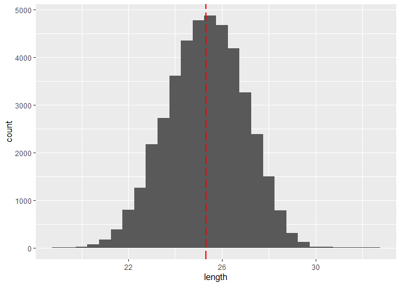

### Dostępność planktonu \[zagęszczenie Calanus finmarchicus gat. 1\] - cfin1

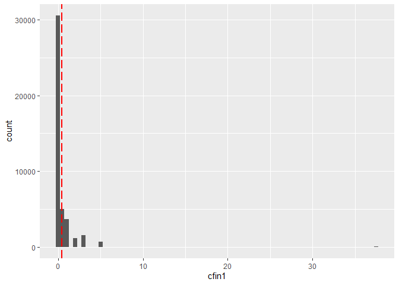

### Dostępność planktonu \[zagęszczenie Calanus finmarchicus gat. 2\] - cfin2

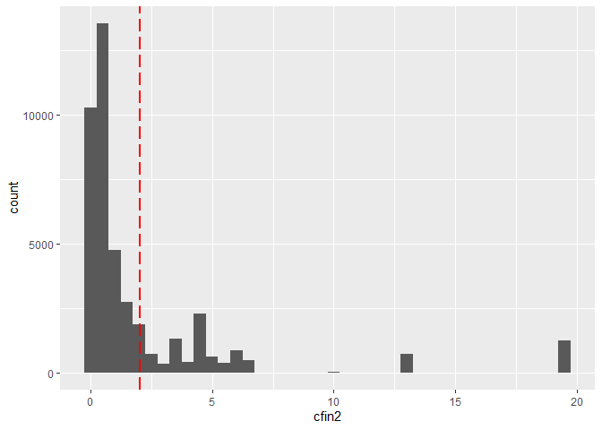

### Dostępność planktonu \[zagęszczenie Calanus helgolandicus gat. 1\] - chel1

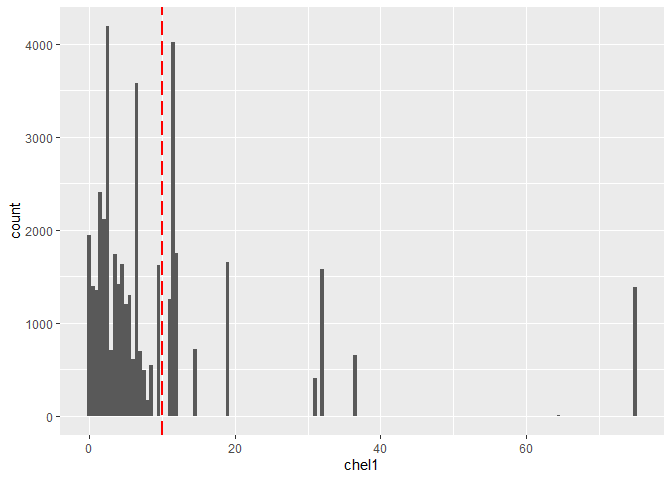

### Dostępność planktonu \[zagęszczenie Calanus helgolandicus gat. 2\] - chel2

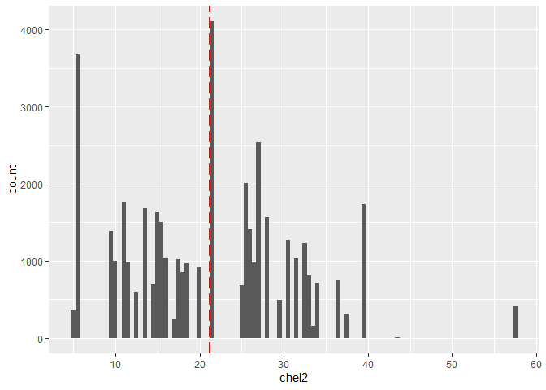

### Dostępność planktonu \[zagęszczenie widłonogów gat. 1\] - lcop1

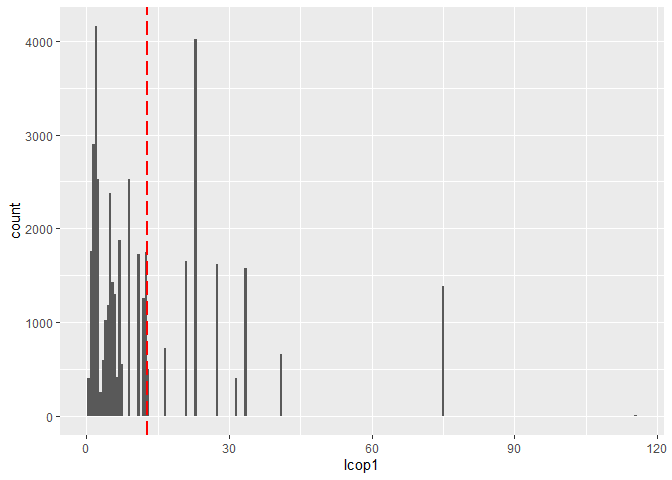

### Dostępność planktonu \[zagęszczenie widłonogów gat. 2\] - lcop2

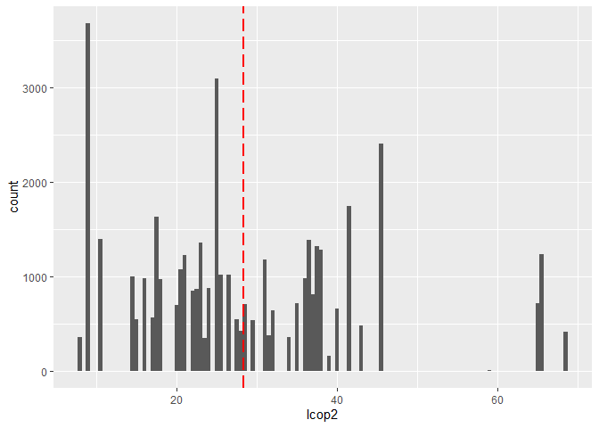

### Natężenie połowów w regionie \[ułamek pozostawionego narybku\] - fbar

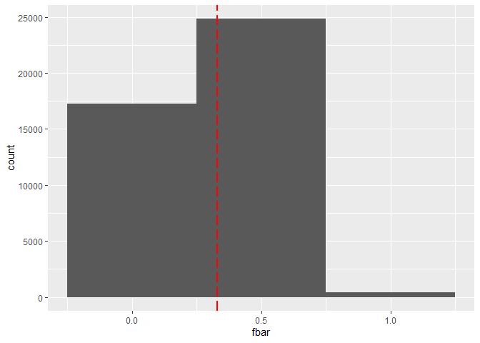

### Roczny narybek \[liczba śledzi\] - recr

    ## `stat_bin()` using `bins = 30`. Pick better value with `binwidth`.

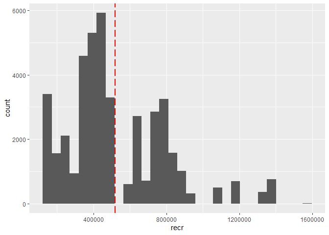

### Łączne roczne natężenie połowów w regionie \[ułamek pozostawionego narybku\] - cumf

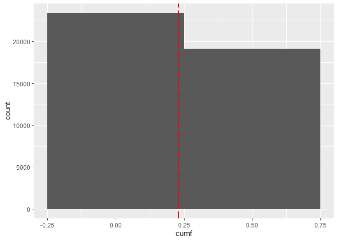

### Łączna liczba ryb złowionych w ramach połowu \[liczba śledzi\] - totaln

    ## `stat_bin()` using `bins = 30`. Pick better value with `binwidth`.

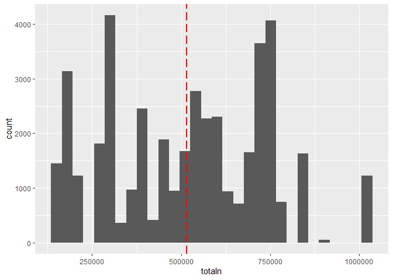

### Temperatura przy powierzchni wody \[°C\] - sst

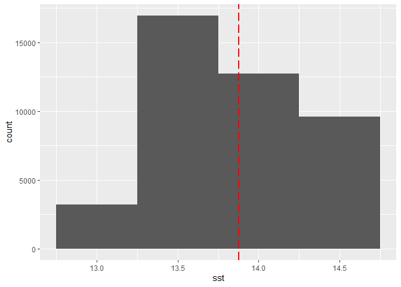

### Poziom zasolenia wody \[Knudsen ppt\] - sal

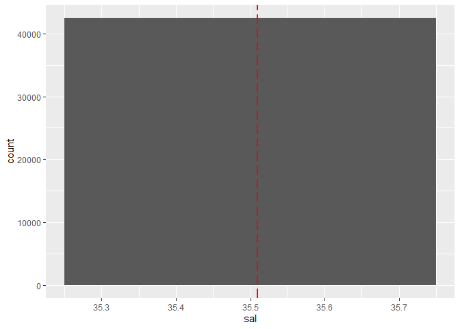

### Miesiąc połowu \[numer miesiąca\] - xmonth

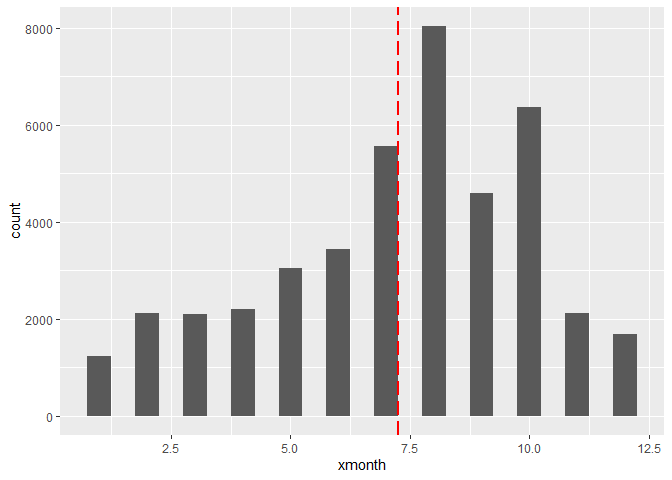

### Oscylacja północnoatlantycka \[mb\] - nao

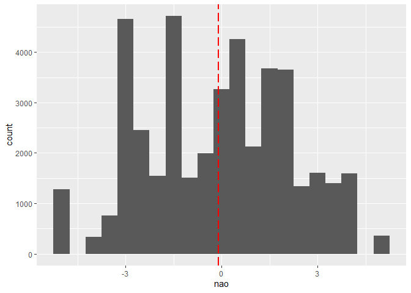

Analiza danych
==============

Postęp zjawiska karłowacenia śledzi
-----------------------------------

Aby potwierdzić zjawisko karłowacenia śledzi, należy sporządzić wykres
zmiany długości złowionych osobników w czasie. Na wykresie dosyć
wyraźnie jest zaznaczony stopniowy spadek rozmiaru śledzia. Z uwagi na
chronologiczne uporządkowanie rekordów oraz brak znaczników czasowych,
jako oś czasu została wykorzystana zmienna porządkowa - “X”.

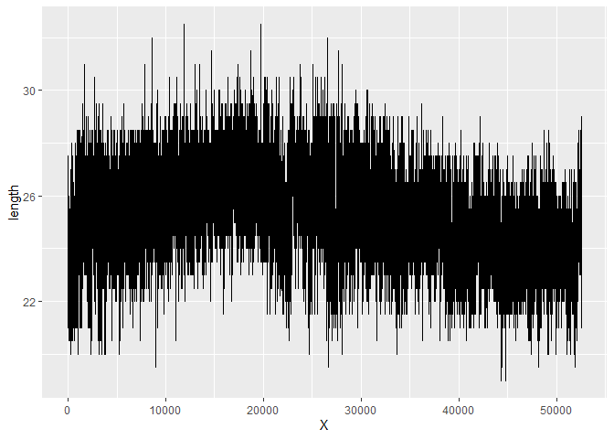

Korelacja zmiennych
-------------------

Wykres korelacji zmiennych znajduje się poniżej. W celu zwiększenia
czytelności, zostały ukryte powtarzające się w macierzy wartości.

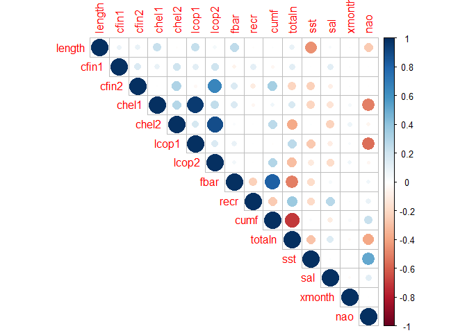

Z powyższego wykresu korelacji można wyciągnąć kilka wniosków.
Interesuje nas szczególnie korelacja z zmiennych z długością śledzi.
Dodatnią korelację w pewnym stopniu wykazuje: zagęszczenie Calanus
helgolandicus gat.1, zagęszczenie widłonogów gat. 1 oraz ułamek
pozostawionego narybku. Jeśli chodzi o korelację ujemną, bardzo silnie
skorelowana jest temperatura przy powierzchni wody oraz w niewielkim
stopniu oscylacja północnoatlantycka. Wymienione powyżej zmienne warto
brać pod uwagę przy analizie przyczyny karłowacenia.

Predykcja
=========

Aby zapewnić zadowalające wyniki analizy, zostały stworzone, wytrenowane
i przetestowane trzy modele regresji dostępne w bibliotece caret,
opierające się na różnych algorytmach: Linear Regression, Random Forest
oraz SVM. Dodatkowy, przy podziale zbioru treningowego została wykonana
metoda Fold Cross Validation w schemacie 5x2. Poniżej znajdują się
efekty trenowania poszczególnych modeli.

Linear Regression
-----------------

    ## Linear Regression 
    ## 
    ## 29744 samples
    ##    14 predictor
    ## 
    ## No pre-processing
    ## Resampling: Cross-Validated (2 fold, repeated 5 times) 
    ## Summary of sample sizes: 14873, 14871, 14871, 14873, 14873, 14871, ... 
    ## Resampling results:
    ## 
    ##   RMSE      Rsquared   MAE     
    ##   1.361341  0.3175711  1.082521
    ## 
    ## Tuning parameter 'intercept' was held constant at a value of TRUE

Random Forest
-------------

    ## Random Forest 
    ## 
    ## 29744 samples
    ##    14 predictor
    ## 
    ## No pre-processing
    ## Resampling: Cross-Validated (2 fold, repeated 5 times) 
    ## Summary of sample sizes: 14871, 14873, 14873, 14871, 14873, 14871, ... 
    ## Resampling results:
    ## 
    ##   RMSE      Rsquared   MAE      
    ##   1.152027  0.5112965  0.9101084
    ## 
    ## Tuning parameter 'mtry' was held constant at a value of 8

SVM
---

    ## Support Vector Machines with Linear Kernel 
    ## 
    ## 29744 samples
    ##    14 predictor
    ## 
    ## No pre-processing
    ## Resampling: Cross-Validated (2 fold, repeated 5 times) 
    ## Summary of sample sizes: 14872, 14872, 14872, 14872, 14872, 14872, ... 
    ## Resampling results:
    ## 
    ##   RMSE      Rsquared   MAE     
    ##   1.363265  0.3160188  1.084089
    ## 
    ## Tuning parameter 'C' was held constant at a value of 1

Porównanie efektywności modeli
------------------------------

Porównanie wybranych modeli pod kątem metryk R2, RMSE i MAE wskazuje, iż
najlepszym z nich jest model Random Forest.

    ## 
    ## Call:
    ## summary.resamples(object = results)
    ## 
    ## Models: LM, SVM, RF 
    ## Number of resamples: 10 
    ## 
    ## MAE 
    ##          Min.   1st Qu.    Median      Mean  3rd Qu.      Max. NA's
    ## LM  1.0750962 1.0775476 1.0821775 1.0825213 1.087615 1.0901759    0
    ## SVM 1.0802152 1.0808392 1.0836936 1.0840892 1.087682 1.0880498    0
    ## RF  0.9085359 0.9090756 0.9096744 0.9101084 0.911221 0.9122243    0
    ## 
    ## RMSE 
    ##         Min.  1st Qu.   Median     Mean  3rd Qu.     Max. NA's
    ## LM  1.352803 1.357509 1.360984 1.361341 1.365390 1.370310    0
    ## SVM 1.355988 1.359681 1.363161 1.363265 1.366428 1.370396    0
    ## RF  1.146804 1.151395 1.152282 1.152027 1.153930 1.154560    0
    ## 
    ## Rsquared 
    ##          Min.   1st Qu.    Median      Mean   3rd Qu.      Max. NA's
    ## LM  0.3120639 0.3151175 0.3178923 0.3175711 0.3200132 0.3229216    0
    ## SVM 0.3086208 0.3147310 0.3160411 0.3160188 0.3176146 0.3234049    0
    ## RF  0.5059758 0.5091388 0.5113613 0.5112965 0.5127107 0.5170255    0

Analiza wyników modeli
======================

W celu poznania przyczyny karłowacenia śledzi z dostępnych danych,
zostałe one oczyszczone oraz przeanalizowane za pomocą modelu regresji.
Poniżej prezentuje się rezultat wytrenowania i uruchomienia najlepszego
modelu (Random Forest), zawierający najbardziej znaczące cechy w
kontekście przewidywania długości śledzi.

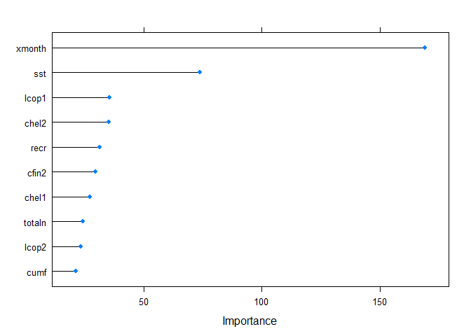

Jak widać najbardziej istotne cechy to: temperatura przy powierzchni
wody, oraz w mniejszym stopnu zagęszczenie widłonogów gat. 1 i
zagęszczenie Calanus helgolandicus gat. 2. O ile miesiąc połowu ma
bardzo duże znaczenie w kontekście wyników regresji, to dla naszej
analizy danych na przestrzeni lat nie ma on znaczenia.
